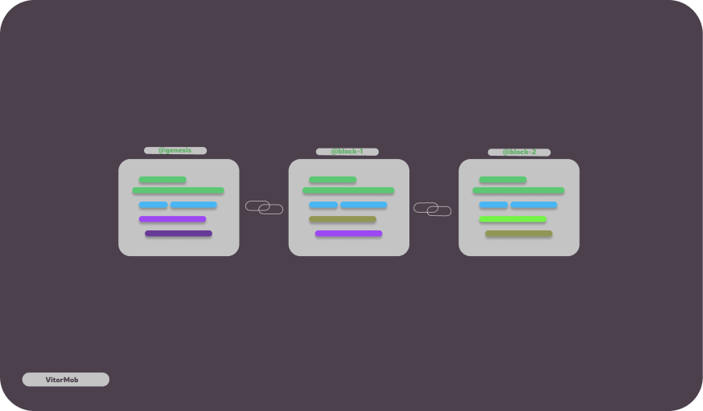

# Simple-Blockchain 
  
  @version 0.1
  @ C++ language
  [@license](LICENSE)
 
## Index

- [Description](#description)
- [Help](#help)
- [Docs](#docs)
- [Change Log](#change-log)

### Description

A simple blockchain code where I make a chain of blocks connected to each other, if a data changes a hash(signature) will change, in other words, every block linked to it will change, thus forming the blockchain feel free to edit the code or else make commit I will be accepting all commits that will add something to the blockchain... I plan in the future to make a simple p2p network.

### Help

For the compiler command, run `make` to run the blockchain run` make run` if you want to clear the compilation of the blockchain run `make clean`

### Docs

[Documentation](docs/Docs.md)
[Dependencies](docs/Dependencies.md)

### Change-Log

`@Version 0.1 beta`
 >  linked blocks
 >  optimized code
 >  cryptography used sha256
